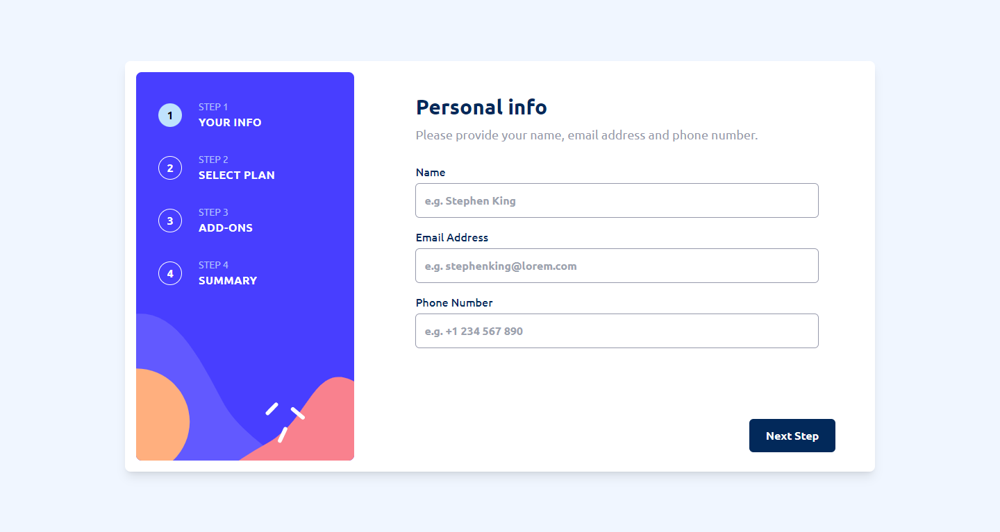

# Frontend Mentor - Multi-step form solution

This is a solution to the [Multi-step form challenge on Frontend Mentor](https://www.frontendmentor.io/challenges/multistep-form-YVAnSdqQBJ). Frontend Mentor challenges help you improve your coding skills by building realistic projects.

## Table of contents

- [Frontend Mentor - Multi-step form solution](#frontend-mentor---multi-step-form-solution)
  - [Table of contents](#table-of-contents)
  - [Overview](#overview)
    - [The challenge](#the-challenge)
    - [Screenshot](#screenshot)
    - [Links](#links)
  - [My process](#my-process)
    - [Built with](#built-with)
    - [What I learned](#what-i-learned)
    - [Continued development](#continued-development)
    - [Useful resources](#useful-resources)
  - [Author](#author)
  - [Acknowledgments](#acknowledgments)

## Overview

### The challenge

Users should be able to:

- Complete each step of the sequence
- Go back to a previous step to update their selections
- See a summary of their selections on the final step and confirm their order
- View the optimal layout for the interface depending on their device's screen size
- See hover and focus states for all interactive elements on the page
- Receive form validation messages if:
  - A field has been missed
  - The email address is not formatted correctly
  - A step is submitted, but no selection has been made

### Screenshot



### Links

- Solution URL: [Solution on Frontend Mentor](https://www.frontendmentor.io/solutions/advanced-multistep-form-w-reacttstailwindcss-XTPp0zjE0G)
- Live Site URL: [Click Me and See ^\_~](https://advanced-form.netlify.app)

## My process

### Built with

- Semantic HTML5 markup
- CSS custom properties
- Flexbox
- Mobile-first workflow
- [React](https://reactjs.org/) - JS library
- [TailwindCSS](https://tailwindcss.com/docs/installation) - For styles

### What I learned

I learned how to make use of custom hooks to encapsulate logic properly.

```js
export const useAddons = () => {
  const { bill, billingMode, updateAddon, addOnsCheckedState, nextPage, plan } =
    useStore(
      (state) => ({
        bill: state.bills,
        billingMode: state.billingMode,
        updateAddon: state.updateAddon,
        addOnsCheckedState: state.addOns,
        nextPage: state.nextPage,
        plan: state.plan,
      }),
      shallow
    );
```

### Continued development

I may or may not add animations. I also wanted to attach the Personal Info Form to state initially but I figured since it's important after you've passed it, it's best I leave it that way 🤷🏾‍♀️

### Useful resources

- [Typescript's official docs](https://www.typescriptlang.org/docs/handbook/utility-types.html) - I was quite heavy on the typescript this time so it was a given I referred to the docs every now and then.
- [Zustand's Github Repo](https://github.com/pmndrs/zustand) - I use zustand all the time so I refer to this one often. Poimandres ^\_~

## Author

- Github - [This is my Github account ^\_^](https://github.com/Di-void)
- Frontend Mentor - [@Multimarix](https://www.frontendmentor.io/profile/Multimarix)
- LinkedIn - [Don Akhirebhulu](https://www.linkedin.com/in/don-akhirebhulu-675082242/)

## Acknowledgments

Thanks [Frontend Mentor](https://www.frontendmentor.io) thank You 💙
